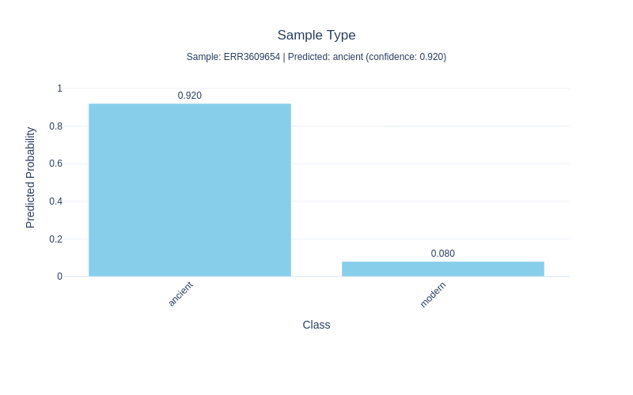
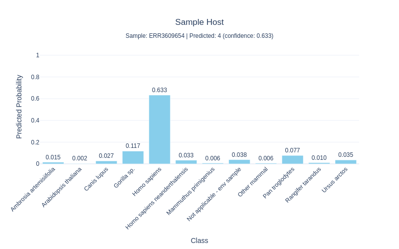

# DIANA: Deep Learning Identification and Assessment of Ancient DNA

**Multi-task classification of ancient DNA samples using unitigs**

DIANA uses unitig sequence features from raw FASTQ files to compare new samples against the whole plethora of existing ancient DNA samples in the SRA, simultaneously predicting four characteristics:
- **Sample Type**: Ancient vs. modern metagenome
- **Community Type**: Oral, gut, skeletal tissue, plant tissue, soft tissue, or environmental sample  
- **Sample Host**: Homo sapiens, Ursus arctos, and 10 other host species
- **Material**: Dental calculus, tooth, bone, sediment, and 9 other material types

The model is trained on 2,609 samples from the [AncientMetagenomeDir database](https://github.com/SPAAM-community/AncientMetagenomeDir), achieving 97-99% accuracy on held-out test data.

---

## Table of Contents

- [Installation](#installation)
- [Quick Start](#quick-start)
  - [Example with Dummy Data](#example-with-dummy-data)
  - [Predict on Your Own Data](#predict-on-your-own-data)
- [Command Reference](#command-reference)
  - [diana-predict](#diana-predict)
- [FAQ](#faq)
  - [Memory Requirements](#memory-requirements)
  - [Out-of-Memory (OOM) Errors](#out-of-memory-oom-errors)
- [License](#license)
- [Citation](#citation)

---

## Installation

### Prerequisites
- **Operating System**: Linux (tested on Ubuntu 20.04+)
- **Package Manager**: [Mamba](https://mamba.readthedocs.io/) or Conda
- **Disk Space**: ~140GB for full reference data, or ~200MB for minimal setup

### Setup

```bash
# Clone the repository
git clone https://github.com/CamilaDuitama/DIANA.git
cd DIANA

# Create and activate the environment
mamba env create -f environment.yml -p ./env
mamba activate ./env

# Install dependencies and download reference k-mers (179MB)
bash install.sh
```

**What gets installed:**
- Python dependencies (PyTorch, scikit-learn, polars, etc.)
- External tools: `back_to_sequences` and `MUSET`
- Reference k-mers file (~179MB, downloaded from Zenodo)
- Pre-trained model checkpoint

**Note**: The full 139GB training matrix (`data/matrices/large_matrix_3070_with_frac/`) is **only needed for retraining the model**. For prediction on new samples, only the reference k-mers file and `unitigs.fa` are required.

---

## Quick Start

### Example with Dummy Data

Test the installation with a small validation sample:

```bash
# Download a small test sample (ancient oral metagenome, ~10MB)
mkdir -p test_data
cd test_data
wget https://ftp.sra.ebi.ac.uk/vol1/fastq/ERR360/004/ERR3609654/ERR3609654_1.fastq.gz
wget https://ftp.sra.ebi.ac.uk/vol1/fastq/ERR360/004/ERR3609654/ERR3609654_2.fastq.gz
cd ..

# Run prediction
mamba run -p ./env diana-predict \
  --sample test_data/ERR3609654_1.fastq.gz test_data/ERR3609654_2.fastq.gz \
  --model results/training/best_model.pth \
  --muset-matrix data/matrices/large_matrix_3070_with_frac \
  --output test_results \
  --threads 4

# View results
cat test_results/ERR3609654/ERR3609654_predictions.json
```

**Expected output:**
```json
{
  "sample_id": "ERR3609654",
  "predictions": {
    "sample_type": {"predicted": "Ancient", "probability": 0.98},
    "community_type": {"predicted": "oral", "probability": 0.95},
    "sample_host": {"predicted": "Homo sapiens", "probability": 0.99},
    "material": {"predicted": "dental calculus", "probability": 0.92}
  }
}
```

**Visualization outputs:**

<p align="center">
  
  
</p>

<p align="center">
  
  
</p>

The plots show predicted probabilities for each class within each task. The dental calculus sample is correctly classified as Ancient, oral community type, from Homo sapiens, with material type dental calculus.

### Predict on Your Own Data

```bash
# Single-end sample
mamba run -p ./env diana-predict \
  --sample path/to/sample.fastq.gz \
  --model results/full_training/best_model.pth \
  --muset-matrix data/matrices/large_matrix_3070_with_frac \
  --output results/my_predictions \
  --threads 8

# Paired-end sample
mamba run -p ./env diana-predict \
  --sample path/to/sample_R1.fastq.gz path/to/sample_R2.fastq.gz \
  --model results/full_training/best_model.pth \
  --muset-matrix data/matrices/large_matrix_3070_with_frac \
  --output results/my_predictions \
  --threads 8
```

**Outputs:**
```
results/my_predictions/sample/
├── sample_predictions.json         # Predictions and probabilities
├── sample_predictions_plot.html    # Interactive visualization
├── sample_predictions_plot.png     # Static plot
├── sample_kmer_counts.txt         # K-mer counts from sample
├── sample_unitig_abundance.txt    # Unitig abundance
└── sample_unitig_fraction.txt     # Unitig fractions (model input)
```

---

## Command Reference

### diana-predict

Predict sample characteristics from FASTQ files.

**Basic usage:**
```bash
diana-predict --sample <fastq> --model <model.pth> --muset-matrix <matrix_dir> --output <outdir>
```

**Required arguments:**
- `--sample`: Path to FASTQ file(s). For paired-end, provide both files separated by space
- `--model`: Path to trained model checkpoint (`.pth` file)
- `--muset-matrix`: Path to MUSET matrix directory containing reference k-mers
- `--output`: Output directory for results

**Optional arguments:**
- `--threads N`: Number of threads for parallel processing (default: 4)
- `--memory-gb N`: Memory limit for k-mer counting step (default: auto-detect)
- `--keep-intermediate`: Keep intermediate files (k-mer counts, etc.)

**Advanced usage:**

Batch prediction from a file list:
```bash
# Create samples.txt with one FASTQ path per line
# For paired-end, put both paths on the same line separated by tab

diana-predict \
  --batch samples.txt \
  --model results/full_training/best_model.pth \
  --muset-matrix data/matrices/large_matrix_3070_with_frac \
  --output results/batch_predictions \
  --threads 16
```

---

---

## FAQ

### Memory Requirements

**Q: How much RAM do I need?**

Memory usage depends on k-mer diversity in your sample, not file size:

- **Ancient DNA (low diversity):** 64-128 GB typically sufficient
- **Modern gut metagenomes:** 128-256 GB
- **Oral/dental calculus (high diversity):** 128-256 GB (3% may need >256 GB)

**Important:** A small 260MB file may require >256 GB if highly diverse, while a 7GB file may need only 64 GB if less complex.

### Out-of-Memory (OOM) Errors

**Q: My job failed with "OUT_OF_MEMORY". What should I do?**

OOM failures occur during k-mer indexing when the sample has high microbial diversity.

**Solutions:**
1. **Check actual memory usage:**
   ```bash
   seff <job_id>  # On SLURM systems
   ```
2. **If >95% memory used:** Retry with 2× RAM
3. **High-diversity samples:** Dental calculus/oral samples often need >256 GB

**Memory patterns from our validation (616 samples):**
- 97% of ancient metagenomes succeeded with ≤128 GB
- Memory expansion: 10× to 1,513× input file size (median: 37×)
- File size is NOT a reliable predictor

---

## License

This project is licensed under the MIT License - see the [LICENSE](LICENSE) file for details.

---

## Citation

If you use DIANA in your research, please cite:

```bibtex
@article{diana2025,
  title={DIANA: Deep Integration of Ancient DNA for Multi-Task Sample Classification},
  author={Duitama, Camila and [Authors]},
  journal={[Journal]},
  year={2025},
  doi={[DOI]}
}
```

---

## Support

For questions, issues, or feature requests:
- **GitHub Issues**: https://github.com/CamilaDuitama/DIANA/issues
- **Documentation**: See `docs/` directory for detailed guides

**Related resources:**
- [AncientMetagenomeDir](https://github.com/SPAAM-community/AncientMetagenomeDir): Training data source
- [Training documentation](docs/TRAINING.md): How to retrain the model
- [CLI reference](docs/CLI_TOOL.md): Detailed command-line interface documentation
