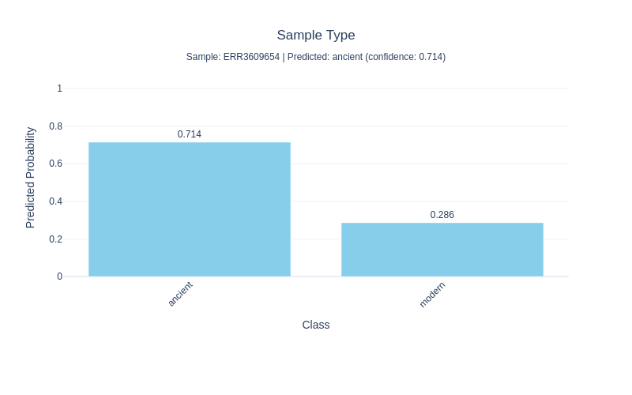
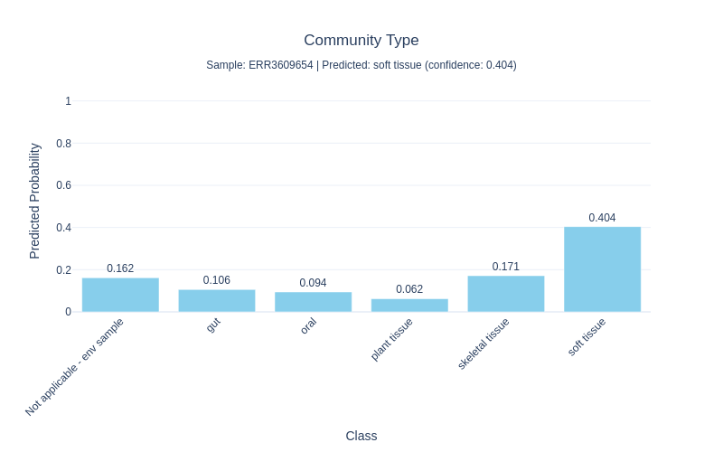
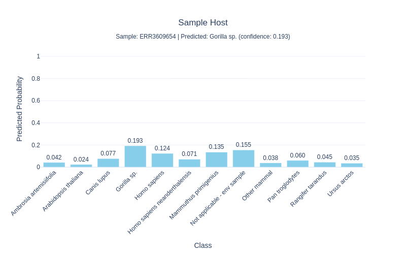
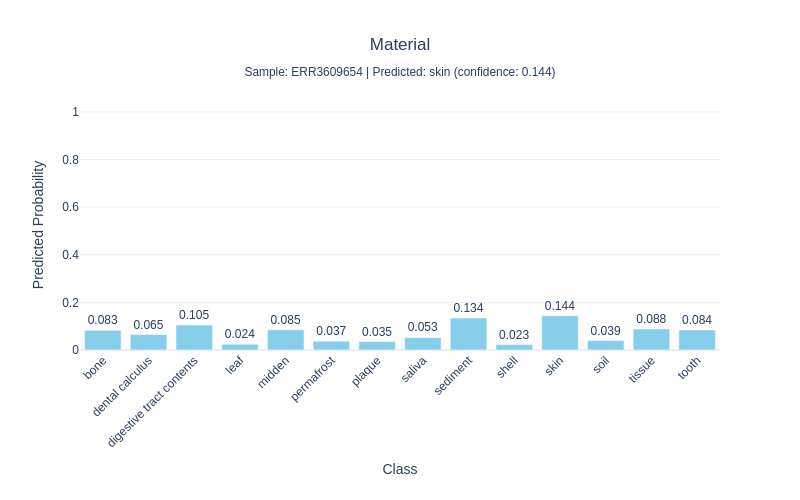
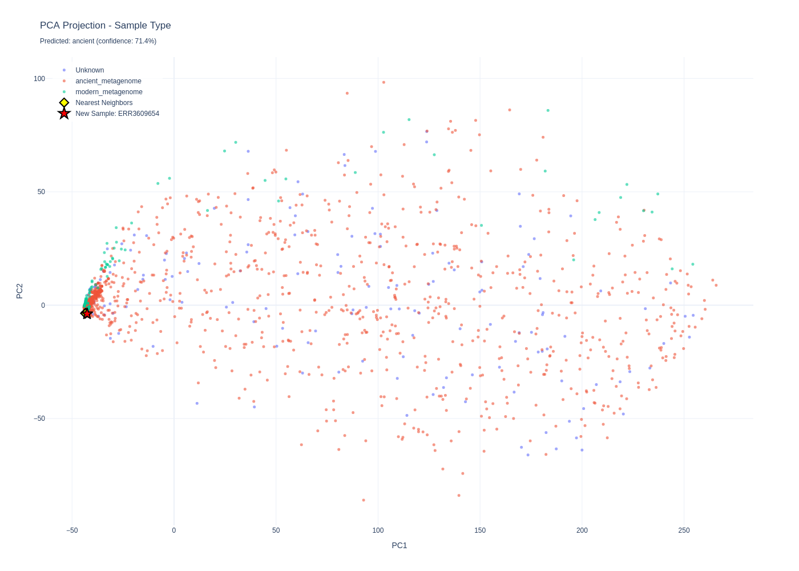
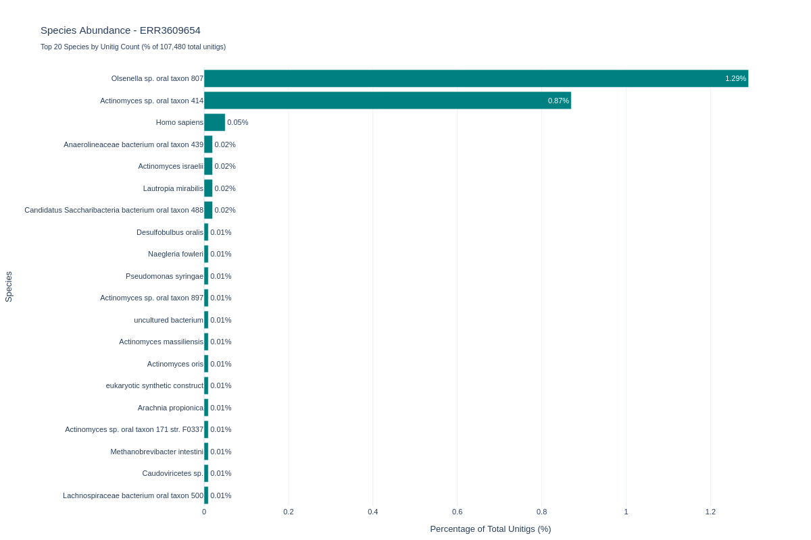

# DIANA: Deep Learning Identification and Assessment of Ancient DNA

[](https://github.com/CamilaDuitama/DIANA/actions/workflows/ci.yml)

Multi-task classification of ancient DNA samples using unitig abundances as features. A **unitig** is a maximal non-branching path in a de Bruijn graph — it compacts overlapping k-mers into a single sequence, reducing redundancy while preserving genomic diversity.

<p align="center">
  
</p>

Given raw sequencing reads, DIANA counts how many reference unitigs are present in the sample and feeds the resulting abundance vector into a multi-task neural network that simultaneously predicts:

| Task | Labels |
|---|---|
| **Sample type** | ancient metagenome, modern metagenome |
| **Community type** | gut, oral, plant tissue, skeletal tissue, soft tissue, not applicable (env sample) |
| **Sample host** | *Homo sapiens*, *Homo sapiens neanderthalensis*, *Pan troglodytes*, *Gorilla sp.*, *Ursus arctos*, *Canis lupus*, *Mammuthus primigenius*, *Rangifer tarandus*, *Ambrosia artemisiifolia*, *Arabidopsis thaliana*, other mammal, not applicable (env sample) |
| **Material** | bone, dental calculus, digestive tract contents, leaf, midden, permafrost, plaque, saliva, sediment, shell, skin, soil, tissue, tooth |

Trained on 2,597 samples from the [AncientMetagenomeDir](https://github.com/SPAAM-community/AncientMetagenomeDir) database.

<p align="center">
  
</p>

---

## Table of Contents

- [Installation](#installation)
- [Quick Start](#quick-start)
- [Usage](#usage)
  - [diana-predict](#diana-predict)
  - [diana-project *(optional)*](#diana-project-optional)
- [FAQ](#faq)
  - [Command not found](#diana-predict-command-not-found)
  - [Out-of-memory errors](#out-of-memory-errors)
  - [HPC / activation issues](#hpc--activation-issues)
- [License](#license)
- [Citation](#citation)

---

## Installation

### Prerequisites
- Linux operating system
- [Mamba](https://mamba.readthedocs.io/) (recommended) or Conda installed and initialised
- At least 10 GB free disk space
- Internet connection for downloading models

```bash
git clone --recurse-submodules https://github.com/CamilaDuitama/DIANA.git
cd DIANA
mamba env create -f environment.yml -p ./env
mamba activate ./env
bash install.sh
```

---

## Quick Start

A small bundled test sample is included in `test_data/` — a 1 % random subsample (seed 42, ~182 k read pairs, 9 MB each) of [ERR3609654](https://www.ebi.ac.uk/ena/browser/view/ERR3609654), an ancient oral metagenome. Use it to verify the installation without downloading the full 1.6 GB dataset.

```bash
diana-predict \
  --sample test_data/ERR3609654_1_small.fastq.gz test_data/ERR3609654_2_small.fastq.gz \
  --model results/training/best_model.pth \
  --training-matrix training_matrix \
  --output test_results
```

View the predictions:

```bash
cat test_results/ERR3609654/ERR3609654_predictions.json
```

`diana-predict` writes results to `test_results/ERR3609654/`:
- `ERR3609654_predictions.json` — predicted class and probability for each task
- `plots/ERR3609654_*_barplot.{html,png}` — one interactive bar chart per task

Each bar chart shows every class on the y-axis and its predicted probability on the x-axis; the most probable class is highlighted. The `.html` version is fully interactive (hover for exact values). Below are the four charts produced for ERR3609654:

**Sample type** — Is the sample ancient or modern?
<p align="center"></p>

**Community type** — What microbial community does the sample come from?
<p align="center"></p>

**Sample host** — Which host species does the sample originate from?
<p align="center"></p>

**Material** — What physical material was the sample extracted from?
<p align="center"></p>

---

## Usage

### diana-predict

```bash
# Single-end
diana-predict --sample sample.fastq.gz \
  --model results/training/best_model.pth \
  --training-matrix training_matrix \
  --output results/predictions

# Paired-end
diana-predict --sample sample_R1.fastq.gz sample_R2.fastq.gz \
  --model results/training/best_model.pth \
  --training-matrix training_matrix \
  --output results/predictions
```

| Argument | Description |
|---|---|
| `--sample` | Gzipped FASTQ or FASTA (`*.fastq.gz`, `*.fq.gz`, `*.fasta.gz`, `*.fa.gz`, `*.fna.gz`). Provide two files for paired-end. |
| `--model` | Path to `best_model.pth` |
| `--training-matrix` | Directory containing `unitigs.fa` and `reference_kmers.fasta` |
| `--output` | Output directory |
| `--threads` | Number of threads (default: 10) |

### diana-project *(optional)*

`diana-project` is an optional companion tool that projects a sample onto the training PCA space, finds its nearest neighbours among the 2,597 training samples, and saves interactive HTML + PNG scatter plots.

```bash
diana-project --sample results/predictions/sample_id/
```

For each prediction task it produces a `pca_projection_<task>.html/png`: training samples are coloured by label, the five nearest neighbours are highlighted in yellow, and the new sample is shown as a red star.

**PCA projection (sample type)** — ERR3609654 (red star) lands among ancient samples. Its five nearest neighbours (yellow diamonds) are all ancient oral metagenomes.
<p align="center"></p>

**Species abundance** — Top microbial species detected in the sample's unitigs, giving a quick taxonomic overview.
<p align="center"></p>

---

## FAQ

### `diana-predict: command not found`

Make sure the environment is activated (`mamba activate ./env`). The `diana-predict` and `diana-project` commands are registered as entry points when the environment is created.

### Out-of-memory errors

OOM during k-mer counting is common for high-diversity samples (dental calculus, oral metagenomes). Retry with more RAM (`--mem=32G` on SLURM). Calculus samples can require >256 GB.

### HPC / activation issues

If `mamba run` is unavailable or broken, activate the environment first and call the command directly:

```bash
mamba activate ./env   # or: source activate ./env
diana-predict ...
```

---

## License

Apache 2.0 — see [LICENSE](LICENSE).

---

## Citation

If you use DIANA in your research, please cite:

```bibtex
@article{diana2026,
  title   = {{DIANA}: Deep Learning Identification and Assessment of Ancient {DNA}},
  author  = {Duitama Gonz{\'{a}}lez, Camila and Lopopolo, Maria and Nishimura, Luca
             and Faure, Roland and Duchene, Sebastian},
  year    = {2026},
  note    = {Correspondence: cduitama@pasteur.fr}
}
```

The trained model weights and PCA reference are hosted on Hugging Face: [cduitamag/DIANA](https://huggingface.co/cduitamag/DIANA).  
Reference k-mers and unitig BLAST annotations are deposited on Zenodo: [10.5281/zenodo.18157419](https://zenodo.org/records/18157419).


